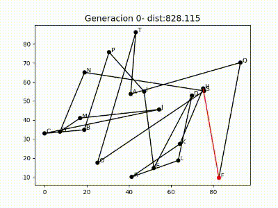

# Algoritmo Genético para el Problema del Viajante de Comercio

Algoritmo genético para la optimización del Problema del Viajante de Comercio

Este proyecto utiliza un enfoque de algoritmo genético para encontrar soluciones aproximadas para el problema. Los algoritmos genéticos son técnicas inspiradas en la evolución biológica que utilizan operadores como selección, cruce y mutación para mejorar iterativamente una población de soluciones candidatas.

## Características

- Generación aleatoria de poblaciones iniciales.
- Operadores genéticos para reproducción y mejora de soluciones.
- Cálculo del costo de la ruta y evaluación de la aptitud individual.
- Elitismo para preservar las mejores soluciones en cada generación.
- Criterios de detención para controlar la convergencia del algoritmo.
- Representación visual generación a generación de las soluciones en evolución en formato MP4.

## Demostración

Puedes encontrar un ejemplo de la ejecución del algoritmo para 20 ubicaciones durante 200 generaciones:

  

## Cómo utilizarlo

1. Clona este repositorio: `git clone https://github.com/salo368/TravelingSalesmanGA.git`
2. Abre el archivo de Jupyter Notebook en tu entorno de Jupyter Notebook preferido.
3. Ejecuta las celdas de código en el cuaderno para ejecutar el script.
4. Si prefieres ejecutar el cuaderno en Google Colab, puedes acceder al script original utilizando este enlace: https://colab.research.google.com/drive/1mjryIGnKV3GuNuSQSUOxw-fasZuBzbW9?usp=sharing.

---

¡Gracias por tu interés en el proyecto TravelingSalesmanGA! Si tienes alguna pregunta o necesitas más información, no dudes en contactarme.
