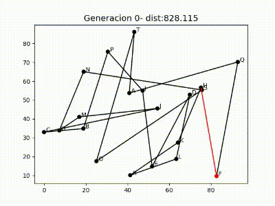

# Traveling Salesman Genetic Algorithm 
<a href="https://github.com/salo368/TravelingSalesmanGA/blob/main/README%20_Spa.md">(View spanish version)</a>

Genetic Algorithm for Traveling Salesman Problem Optimization

This project utilizes a genetic algorithm approach to find approximate solutions to the TSP. Genetic algorithms are techniques inspired by biological evolution that use operators such as selection, crossover, and mutation to iteratively improve a population of candidate solutions.

## Features

- Random generation of initial populations.
- Genetic operators for reproduction and solution improvement.
- Calculation of route cost and evaluation of individual fitness.
- Elitism to preserve the best solutions in each generation.
- Stopping criteria to control algorithm convergence.
- Generation-wise visual representation of the evolving solutions in MP4 format.

## Demonstration

You can find an example of the algorithm's execution for 20 locations over 200 generations:

  

## System Requirements

- Python 3 (version 3.10.3)

## How to Use

1. Clone this repository: `git clone https://github.com/salo368/TravelingSalesmanGA.git`
2. Install the dependencies you will find in: `requirements.txt`
3. Open the Jupyter Notebook file in your preferred Jupyter Notebook environment.
4. Execute the code cells in the notebook to run the script.
5. If you prefer to run the notebook in Google Colab, you can access the original script using this link: `https://colab.research.google.com/drive/1mjryIGnKV3GuNuSQSUOxw-fasZuBzbW9?usp=sharing`

---

Thank you for your interest in the TravelingSalesmanGA project! If you have any questions or need further information, feel free to contact me.
